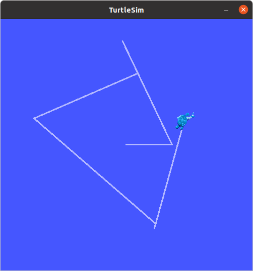
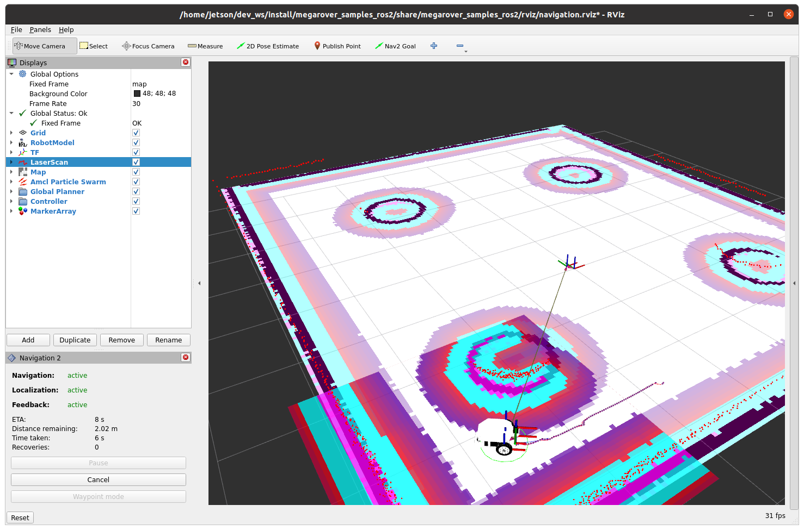

# l4t-ros2-docker

## Introduction

This is a Dockerfile to make ROS 2 environment on Jetson device.  
This Dockerfile is based on [nvidia/container-images/l4t-base](https://gitlab.com/nvidia/container-images/l4t-base).

## Requirements

- Docker
- nvidia-docker2

## Version

|L4T version of package|ROS 2 distribution|Dockerfile|
|---|---|---|
|35.3.1|Humble|[humble/Dockerfile](humble/Dockerfile)|

## Checked applications

I tested on Jetson Orin NX 16GB.

### demo_nodes_cpp

```bash
$ ros2 run demo_nodes_cpp talker
[INFO] [1683313006.304406217] [talker]: Publishing: 'Hello World: 1'
[INFO] [1683313007.304254294] [talker]: Publishing: 'Hello World: 2'
[INFO] [1683313008.304208091] [talker]: Publishing: 'Hello World: 3'
[INFO] [1683313009.304162780] [talker]: Publishing: 'Hello World: 4'
[INFO] [1683313010.304098489] [talker]: Publishing: 'Hello World: 5'
```

```bash
$ ros2 run demo_nodes_py listener
[INFO] [1683313006.326180969] [listener]: I heard: [Hello World: 1]
[INFO] [1683313007.306190692] [listener]: I heard: [Hello World: 2]
[INFO] [1683313008.306295810] [listener]: I heard: [Hello World: 3]
[INFO] [1683313009.306328576] [listener]: I heard: [Hello World: 4]
[INFO] [1683313010.306021672] [listener]: I heard: [Hello World: 5]
```

### turtlesim



### Navigation2



## Reference

- <https://gitlab.com/nvidia/container-images/l4t-base>
- <https://docs.ros.org/en/humble/Installation/Ubuntu-Install-Debians.html>
